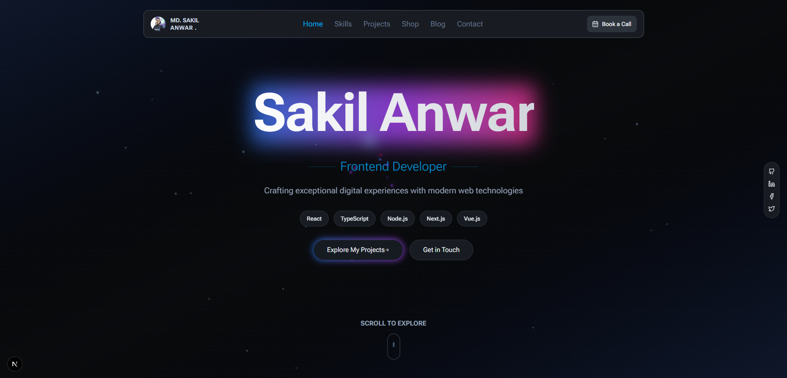

## Personal Portfolio — Sakil Anwar

This repository contains the source code for my personal portfolio website, built with Next.js 16, TypeScript, and Tailwind CSS.
The project is structured as a clean, modern, and scalable frontend foundation that showcases my work and experience as a Frontend Web Developer.

The codebase is fully open-source, so developers are welcome to use it as a reference, learn from it, or customize it for their own portfolio.

## Tech Stack

- Next.js 16
- React 19
- TypeScript
- Tailwind CSS
- ShadCN UI
- Framer Motion
- Lucide Icons

## Features

- Fully responsive, clean UI
- Modern animations using Framer Motion
- Reusable & scalable component architecture
- SEO optimized
- Fast loading and high performance
- Project showcase, skills, experience, and contact sections

## Installation Guide

Follow the steps below to set up this project locally.

1. Clone the Repository

```bash
git clone https://github.com/sakilanwar12/sakil-anwar.git
cd sakil-anwar
```

2. Install Dependencies

Using pnpm (recommended):

```bash
pnpm install
```

Or using npm:

```bash
npm install
```

Or using yarn:

```bash
yarn install
```

3. Start the Development Server

```bash
pnpm run dev
```

The project will run at:

```bash
http://localhost:3000
```

4. Build for Production

```bash
   pnpm build
```

5. Run the Production Build

```bash
   pnpm start
```

## Project Structure

```bash
├── src/
│   ├── app/
│   │   ├── api/
│   │   ├── layout.tsx
│   │   └── page.tsx
│   ├── components/
│   │   ├── ui/
│   │   ├── sections/
│   │   └── shared/
│   ├── hooks/
│   ├── lib/
│   ├── styles/
│   └── providers/
├── public/
├── package.json
├── tsconfig.json
└── README.md

```

👨‍💻 About the Developer

_Sakil Anwar_ — Frontend Web Developer

Experienced in building modern, scalable web applications with a focus on clean architecture, responsive design, and API integration. Skilled in:

- React & Next.js
- Vue & Nuxt
- Tailwind CSS
- Custom UI systems & admin dashboards
- Reusable component architecture
- API integration using RTK Query, TanStack Query, and RESTful APIs

Passionate about creating high-performance frontend applications and maintainable codebases.

### Contact

Portfolio: [Portfolio Website](https://sakil-anwar-rfq5.vercel.app/)

Email: sakilanwar60@gmail.com

LinkedIn: [Linkedin](https://www.linkedin.com/in/md-sakil-anwar-4b6941241/)

GitHub: https://github.com/sakilanwar12/

📄 License

This project is licensed under the MIT License.
You may use, modify, and distribute this code with proper attribution.
